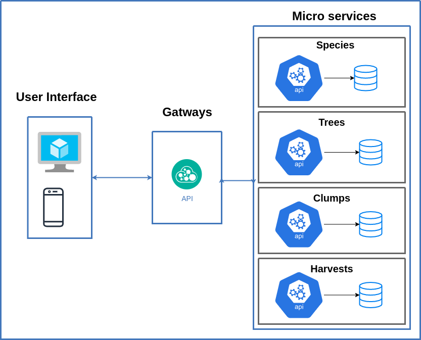

# Agriservice

Desafio do projeto, é desenvolver uma aplicação para gerenciar o pomar de um produtor de frutas.

***

## Definição

O pomar precisa catalogar suas plantas, organizando-as em grupos e espécies e manter um histórico da colheita. Sendo assim a aplicação tem os seguintes requisitos:

- Gerenciar árvores, espécies de árvores e grupos de árvores.
- Gerenciar a colheita realizada por árvore ou grupo de árvore.
- Disponibilizar um relatório ou tela de visualização das colheitas Incluindo filtros de árvore, grupo de árvore, espécie e período.

## Especificações técnicas

Implementar uma api rest e uma aplicação web.
Implementar testes unitários para validar seu código.
Utilize um banco de dados relacional ou no-sql para armazenar os dados.

## Definição básica de modelos

- ***Espécies***: Código e Descrição.
- ***Árvores***: Código, Descrição, Idade e Espécie.
- ***Grupos de Árvores***: Código, Nome, Descrição e Árvores.
- ***Colheita***: Informações, Data de Colheita, Peso Bruto e Árvore.

***

## Tecnologias

* [Docker](https://www.docker.com/) - Isolamento de ambiente
* [MongoDB](https://www.nginx.com/) - Storage
* [Nginx](https://www.nginx.com/) - Http server and proxy reverse
* [Node.js](https://nodejs.org/en/) - Runtime builder

***

## Arquitetura

